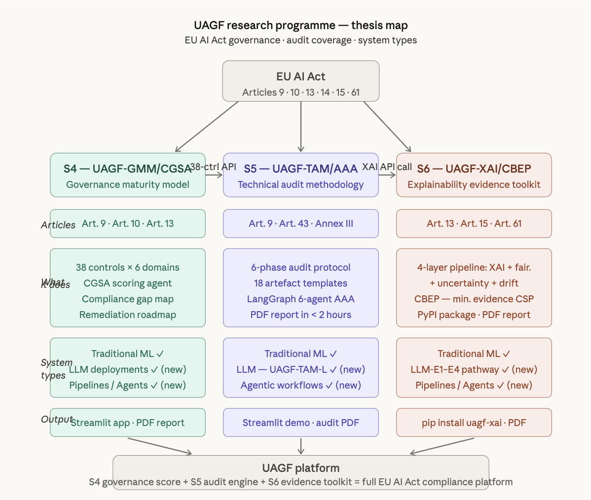

# UAGF-XAI

UAGF-XAI is an MSc thesis project and the S6 audit-evidence component of the
**Unified AI Governance Framework (UAGF)**. It turns normalized governance and
technical-audit context into an auditable evidence plan, executes compatible
explainability and monitoring methods, and generates structured HTML and PDF
audit reports.

## UAGF Research Platform

UAGF is a research programme for connecting organizational AI governance,
technical audit preparation, and execution-level evidence generation. Its three
thesis components have deliberately separate responsibilities:

| Component | Project role | Main responsibility | Downstream output |
| --- | --- | --- | --- |
| S4 — UAGF-GMM/CGSA | Governance maturity | Assess organizational controls and governance readiness | Governance score, verdict, and domain scores |
| S5 — UAGF-TAM/AAA | Technical audit methodology | Establish the audit scope, system/risk context, findings, and technical resource references | Normalized audit context and resource contract |
| S6 — UAGF-XAI/CBEP | Audit evidence toolkit | Plan and execute compatible evidence methods and report their results | Structured evidence plus HTML/PDF reports |

Together, the components support a flow from governance assessment to audit
context and finally to technical evidence. They are complementary rather than
interchangeable: S4 assesses governance, S5 defines the audit engagement, and
S6 generates evidence. UAGF-XAI does not replace the upstream assessments or
make a final legal-compliance decision.



The map is theoretical programme material. The implementation described below
preserves its high-level division of responsibility while documenting the
practical contract and validation adjustments made during development.

### Upstream S4: UAGF-GMM/CGSA

S4 evaluates governance maturity across the UAGF control domains. The S6
adapter consumes a compact `GovernanceContext` containing:

- the composite governance maturity score;
- the governance verdict;
- the per-domain maturity scores, including transparency and monitoring.

These values are planning signals. For example, CBEP can broaden the evidence
sweep when overall maturity is low, promote explainability when transparency
is weak, or promote drift evidence when monitoring maturity is weak. S6 does
not recalculate the S4 assessment.

### Upstream S5: UAGF-TAM/AAA

S5 defines the formal technical-audit context. Its normalized `AuditContext`
provides:

- system type, modality, task type, application domain, and risk tier;
- applicable EU AI Act articles, audit findings, and the upstream CSP/status
  signal;
- model artifact URI, artifact kind, format, framework, type, and optional
  directory entrypoint;
- traditional training/reference and evaluation datasets, or an LLM golden
  set and optional prompt/RAG/guardrail resources;
- target, positive-label, sensitive-feature, and counterfactual-policy
  metadata where applicable.

S5 supplies five of the six final validation cases. The sixth case is an
explicitly S6-owned local LLM execution-validation configuration and is not
represented as an S5 delivery.


## S6 Thesis Project: UAGF-XAI

UAGF-XAI is a Python audit-evidence framework. Its main contribution is the
orchestration of established evidence tools through a unified, context-aware,
reproducible pipeline. It does not claim that the underlying SHAP, LIME, DiCE,
Fairlearn, MAPIE, or Evidently algorithms were newly invented in this thesis.

The S6 workflow performs six main functions:

1. normalize S4 and S5 inputs through dedicated adapters;
2. resolve the exact model and data resources described by the audit contract;
3. use CBEP to construct a minimum-sufficient operational evidence plan;
4. execute only methods compatible with the system, task, modality, and
   available resources;
5. normalize heterogeneous outputs into one `EvidenceResult` schema;
6. generate reproducible, case-specific HTML and PDF audit reports.

The final implemented scope is **six traditional ML evidence methods plus four
professor-defined LLM/agentic methods**.

## Implemented Evidence Pathways

### Traditional ML: four evidence layers

| Layer | Method | Evidence produced | Main applicability boundary |
| --- | --- | --- | --- |
| Layer 1 — Explainability | SHAP | Global feature attribution or text token/n-gram attribution | Fitted estimator and supported model input |
| Layer 1 — Explainability | LIME | One-sample local surrogate explanation and fidelity | Current tabular/text classification and tabular regression paths |
| Layer 1 — Explainability | DiCE | Structured counterfactual explanations | Tabular classification with a probability interface |
| Layer 2 — Fairness | Fairlearn | Demographic parity, equalized odds, and group selection rates | Classification with S5-declared sensitive features |
| Layer 3 — Uncertainty | MAPIE | Conformal prediction sets or numeric intervals | Classification, regression, and forecasting with a fitted estimator |
| Layer 4 — Drift | Evidently plus feature tests | Canonical model-input distribution drift | Reference and current data with authoritative feature scope |

### LLM / Agentic pathway

The LLM pathway uses the professor-defined method names and ordering:

| ID | Method | Evidence role |
| --- | --- | --- |
| LLM-E1 | Grounding Score | Semantic alignment between generated continuation and supplied context/reference text |
| LLM-E2 | Self-Consistency Score | Semantic consistency across repeated seeded generations |
| LLM-E3 | Semantic Drift Index | Controlled semantic change between baseline and current prompt sets |
| LLM-E4 | Differential Prompt Fairness | Output sensitivity across explicitly matched demographic prompt pairs |

Aequitas, MC Dropout, automatic protected-attribute inference, external model
downloads, and fabricated LLM predictions are not part of the final scope.

## Evidence Tools: Purpose and Audit Role

The evidence methods answer different audit questions. They are intentionally
combined because no single method can explain model behaviour, assess group
outcomes, quantify predictive uncertainty, and monitor changing inputs at the
same time. Each result is technical evidence for an auditor to interpret; none
of the tools independently establishes legal compliance.

### SHAP — feature attribution

**Question answered:** Which model inputs contributed most strongly to the
model's predictions?

SHAP assigns contribution values to model features. UAGF-XAI aggregates the
absolute contribution magnitudes to produce a global ranking and saves a SHAP
visualization. For fitted traditional NLP pipelines, the same pathway reports
the original TF-IDF vocabulary tokens and n-grams instead of replacing them
with generic feature identifiers.

**Audit value:** SHAP supports transparency and model-behaviour inspection by
showing which variables dominate the fitted model's outputs. It contributes
primarily to Article 13 evidence.

**Main outputs:** ranked features or tokens/n-grams, attribution magnitudes,
explainer metadata, and a summary plot.

**Interpretation boundary:** attribution describes model behaviour, not causal
influence or the correctness of the learned relationship.

### LIME — local surrogate explanation

**Question answered:** Why did the model produce this prediction for one
particular evaluation instance?

LIME perturbs inputs around a selected sample and fits a simpler local
surrogate to approximate the original model near that point. UAGF-XAI records
the local feature or token contributions together with the surrogate fidelity
score.

**Audit value:** LIME complements SHAP with an instance-level explanation that
can help an auditor inspect an individual decision or text prediction. It also
supports Article 13 transparency evidence.

**Main outputs:** sample index, local feature/token contributions, predicted
class or value, local surrogate prediction, fidelity, and an HTML explanation
artifact.

**Interpretation boundary:** LIME explains a local neighborhood, not the whole
model. A low fidelity score means the surrogate is a weak approximation and
must be interpreted cautiously.

### DiCE — counterfactual explanation

**Question answered:** Which allowed feature changes could lead the model to a
different prediction?

DiCE searches for alternative input instances that change the model outcome.
UAGF-XAI stores every generated counterfactual in structured JSON and reports
the original prediction, counterfactual prediction, changed features, and the
validated actionable/immutable/sensitive-feature policy.

**Audit value:** counterfactuals provide a human-readable what-if view of a
classification decision and complement attribution methods in Layer 1
Explainability. They contribute to Article 13 evidence.

**Main outputs:** one or more counterfactual instances, prediction changes,
changed-feature counts and values, feature-policy metadata, and a JSON
artifact.

**Interpretation boundary:** generated changes are mathematical explanations,
not recommendations. They may be infeasible, undesirable, or non-actionable
and require domain-expert review. The current implementation supports tabular
classification, not text, forecasting, or anomaly detection.

### Fairlearn — group fairness metrics

**Question answered:** Do observed prediction outcomes differ across the
sensitive groups explicitly identified in the S5 audit context?

Fairlearn compares predictions by sensitive-feature group. UAGF-XAI calculates
demographic parity difference, equalized odds difference, and per-group
selection rates using the declared positive label.

**Audit value:** the metrics make statistical outcome disparities visible and
provide evidence relevant to Article 10 data-governance and fairness review.

**Main outputs:** evaluated sensitive columns, demographic parity difference,
equalized odds difference, and group selection rates.

**Interpretation boundary:** UAGF-XAI does not infer protected attributes.
Missing S5 sensitive-feature metadata produces an evidence gap. Statistical
disparity does not by itself prove unlawful discrimination or explain its
cause.

### MAPIE — conformal uncertainty estimation

**Question answered:** How much uncertainty surrounds the fitted model's
predictions, and does the observed conformal coverage match the requested
confidence level?

MAPIE adds conformal uncertainty evidence without retraining the audited
estimator. UAGF-XAI uses the original fitted S5 estimator in prefit mode and
divides evaluation data into disjoint conformal-calibration and measurement
subsets. Classification produces prediction sets; regression and forecasting
produce numeric prediction intervals.

**Audit value:** MAPIE makes uncertainty and coverage measurable rather than
relying only on point predictions. Its evidence supports Articles 9, 14, and
15 concerning risk, oversight, accuracy, and robustness.

**Main outputs:** confidence level, empirical coverage, coverage gap,
prediction-set size or interval width, estimator mode, and calibration policy.

**Interpretation boundary:** reported coverage depends on the available
calibration and measurement data. Forecasting intervals are marginal and do
not explicitly model temporal dependence.

### Evidently and feature drift tests — distribution monitoring

**Question answered:** Have the authoritative model-input distributions changed
between the reference/training data and the current evaluation data?

Evidently provides the canonical per-feature drift assessment when its result
can be extracted consistently. UAGF-XAI also records numeric Kolmogorov-Smirnov
and categorical Jensen-Shannon tests as supplementary or fallback evidence.
For traditional NLP, text drift is evaluated through derived document and
fitted-token statistical characteristics of the authoritative text column.

**Audit value:** drift evidence helps identify changing operating conditions
that may require investigation or post-market monitoring. It contributes to
Articles 15 and 61.

**Main outputs:** analyzed feature scope, per-feature test results, drifted
features, drift share, dataset-level drift decision, thresholds, and a
structured JSON artifact.

**Interpretation boundary:** input-distribution drift does not prove concept
drift, reduced model performance, or a compliance failure. Contextual columns
outside the fitted model input do not override the canonical model-input drift
conclusion.

### LLM-E1 — Grounding Score

**Question answered:** How closely does a generated continuation align
semantically with the supplied context or reference answer?

LLM-E1 generates a continuation for each golden-set record, embeds the
continuation and reference/context text, and calculates cosine similarity.

**Audit value:** the score provides execution-level grounding evidence for LLM
transparency and Article 13 review.

**Main outputs:** per-record grounding scores, mean, median, minimum and maximum
alignment, generation metadata, and prompt-echo diagnostics.

**Interpretation boundary:** semantic similarity is not a calibrated
probability and does not prove factual accuracy, legal correctness, or complete
support for every generated claim.

### LLM-E2 — Self-Consistency Score

**Question answered:** Does the LLM produce semantically consistent outputs when
the same prompt is sampled repeatedly?

LLM-E2 generates five seeded stochastic continuations for each configured
prompt and compares all pairwise embedding similarities. The local validation
case uses three prompts and five generations per prompt.

**Audit value:** repeated-generation consistency provides reliability and
uncertainty evidence relevant to Articles 9, 14, and 15.

**Main outputs:** prompt count, generations per prompt, seeds, pairwise semantic
similarities, per-prompt consistency, and aggregate consistency.

**Interpretation boundary:** stable outputs can still be wrong, and variable
outputs can sometimes reflect legitimate ambiguity. The score must be read
together with grounding and task context.

### LLM-E3 — Semantic Drift Index

**Question answered:** How different are generated outputs across an explicitly
paired baseline and current prompt set?

LLM-E3 generates deterministic continuations for matched baseline/current
prompts, embeds the outputs, and calculates pairwise and centroid semantic
distance. The reported Semantic Drift Index is the centroid distance.

**Audit value:** it validates the semantic monitoring pathway associated with
Articles 15 and 61.

**Main outputs:** paired generation records, pairwise semantic distances,
centroid similarity, centroid distance, embedding-model metadata, and the
Semantic Drift Index.

**Interpretation boundary:** the current S6 local case is controlled synthetic
validation, not observed production drift, and no legal threshold is inferred
from the score.

### LLM-E4 — Differential Prompt Fairness

**Question answered:** How much does the generated output change when an
explicitly matched prompt varies only a controlled demographic attribute?

LLM-E4 runs paired prompts, embeds both continuations, and reports semantic
output difference together with prompt-echo diagnostics. The fixture validates
that each pair differs only in the declared demographic substitution.

**Audit value:** differential prompt testing exposes output sensitivity relevant
to Article 10 fairness review when standard classification group metrics are
not appropriate for generative systems.

**Main outputs:** controlled attributes, matched pair records, per-pair output
similarity/difference, aggregate output difference, generation configuration,
and evidence-quality flags.

**Interpretation boundary:** output difference does not independently establish
fairness or unlawful discrimination. The current local DistilGPT2 result is
explicitly marked `limited_by_degenerate_generation` because all four pairs
exhibited prompt-echo behavior.

### How the evidence fits together

For traditional ML, the four layers answer complementary questions:

```text
Explainability -> What drove the prediction?
Fairness       -> Do outcomes differ across declared groups?
Uncertainty    -> How reliable or well-covered are predictions?
Drift          -> Has the model-input environment changed?
```

For LLM/agentic systems, LLM-E1 through LLM-E4 provide corresponding evidence
for grounding, reliability, semantic monitoring, and differential prompt
behavior. CBEP decides which applicable methods are required; the report keeps
their outputs, limitations, and execution status separate rather than merging
them into one unsupported compliance score.

## Architecture and End-to-End Workflow

The same workflow is used in the thesis notes and UAGF platform documentation.
It makes the two independent S6 inputs explicit: CBEP receives normalized
contexts, while ResourceLoader resolves execution resources. The method plan
and `ResourceBundle` meet only at the Executor boundary.

```text
┌────────────────────────┐                   ┌────────────────────────────────┐
│ Input 1:               |                   | Input 2:                       |
|   S4 Governance JSON   │                   │   S5 Audit JSON or             │
└───────────┬────────────┘                   │   S6 Local Validation Config   │
            ▼                                └───────────────┬────────────────┘
┌────────────────────────┐                                   ▼
│ Governance Adapter     │                ┌──────────────────────────────────────┐
└───────────┬────────────┘                │ Audit Adapter / Local Config Adapter │
            ▼                             └──────────────────┬───────────────────┘
┌────────────────────────┐                                   ▼
│ GovernanceContext      │                    ┌─────────────────────────────┐
└───────────┬────────────┘                    │        AuditContext         │
            │                                 └─────┬─────────────────┬─────┘
            │ planning context                      │ for planning    │ for resources loading
            └───────────────────┐        ┌──────────┘                 ▼
                                ▼        ▼                  ┌────────────────────┐
                         ┌────────────────────┐             │ ResourceLoader     │
                         │ CBEP Planner       │             └─────────┬──────────┘
                         └─────────┬──────────┘                       │
                                   │                      ┌───────────┼────────────┐
                                   │                      ▼                        ▼
                                   │                    Model Loader          Dataset Loader
                                   │                      └───────────┬────────────┘
                                   │                                  ▼
                                   ▼                        ┌────────────────────┐
                         ┌────────────────────┐             │ ResourceBundle     │
                         │ Evidence Plan      │             └─────────┬──────────┘
                         │ + Planning Trace   │                       │
                         └─────────┬──────────┘                       │
                                   └──────────────┬───────────────────┘
                                                  ▼
                                        ┌────────────────────┐
                                        │ Evidence Executor  │
                                        └─────────┬──────────┘
                                                  ▼
                                        ┌────────────────────┐
                                        │ Select Pathway     │
                                        └─────────┬──────────┘
                             ┌────────────────────┴─────────────────────┐
                             ▼                                          ▼
             ┌──────────────────────────────────┐      ┌──────────────────────────────────────┐
             │ If Traditional ML system         │      │ Else LLM / Agentic system            │
             ├──────────────────────────────────|      ├──────────────────────────────────────|
             │ Layer 1: Explainability (SHAP,   │      | LLM-E1: Grounding Score              |
             │          LIME, DiCE)             │      | LLM-E2: Self-Consistency Score       |
             │ Layer 2: Fairness (Fairlearn)    │      | LLM-E3: Semantic Drift Index         |
             │ Layer 3: Uncertainty (MAPIE)     │      | LLM-E4: Differential Prompt Fairness |
             │ Layer 4: Drift (Evidently)       │      |                                      |
             └─────────────────┬────────────────┘      └───────────┬──────────────────────────┘
                               └────────────────┬──────────────────┘
                                                ▼
                                      ┌────────────────────┐
                                      │ Evidence Normalizer│
                                      └─────────┬──────────┘
                                                ▼
                                      ┌────────────────────┐
                                      │ EvidenceResult     │
                                      └─────────┬──────────┘
                                                ▼
                                      ┌────────────────────┐
                                      │ HTML + PDF Report  │
                                      └────────────────────┘
```

`AuditContext` intentionally has two read-only consumers:

- **ResourceLoader** reads the resource-contract fields needed to locate and
  load the model, datasets, golden set, and optional LLM resources.
- **CBEP** reads the planning fields needed to select evidence, such as risk
  tier, applicable articles, system type, task type, modality, and the upstream
  CSP/status signal.

The responsibilities do not overlap. CBEP never loads artifacts, ResourceLoader
never selects evidence methods, `GovernanceContext` is used only by CBEP, and
`ResourceBundle` is passed to the Executor rather than back into the planner.

### Architectural boundaries

- Only adapters parse S4/S5 JSON.
- Only resource loaders resolve files, folders, datasets, and raw URIs.
- CBEP consumes `AuditContext` and `GovernanceContext`, not `ResourceBundle`.
- Evidence layers receive resolved objects and do not open S4/S5 resources.
- The exact fitted S5 artifact remains the source of predictions.
- Saved encoders and vectorizers are used read-only; they are not refitted.
- Traditional ML and LLM resource contracts remain separate.
- S6 local LLM configuration remains separate from the formal S5 contract.
- Evidence status is explicit: `completed`, `skipped`, `failed`, or
  `not_applicable`.

## Constraint-Based Evidence Planner

CBEP is the core thesis contribution. It is a deterministic,
constraint-informed planner inspired by constraint satisfaction theory. It
does not claim to use a generic CSP solver. The S5 `csp_satisfied` field is an
upstream audit-status signal that can broaden the sweep; it is not an S6 solver
result.

```text
                 ┌──────────────────────────────────┐
                 │ AuditContext + GovernanceContext │
                 └────────────────┬─────────────────┘
                                  ▼
                 ┌──────────────────────────────────┐
                 │ Select System Pathway            │
                 └────────────────┬─────────────────┘
                    ┌─────────────┴─────────────┐
                    ▼                           ▼
       ┌────────────────────────┐  ┌────────────────────────┐
       │ Traditional Catalogue  │  │ LLM-E1 to LLM-E4       │
       └────────────┬───────────┘  └────────────┬───────────┘
                    └─────────────┬─────────────┘
                                  ▼
                 ┌──────────────────────────────────┐
                 │ Build Risk-Tier Base Plan        │
                 └────────────────┬─────────────────┘
                                  ▼
                 ┌──────────────────────────────────┐
                 │ Add EU AI Act Requirements       │
                 └────────────────┬─────────────────┘
                                  ▼
                 ┌──────────────────────────────────┐
                 │ S4 Governance Priority?          │
                 └────────────────┬─────────────────┘
                          ┌───────┴───────┐
                      Yes ▼               ▼ No
       ┌────────────────────────┐         │
       │ Promote Methods or     │         │
       │ Broaden Evidence Sweep │         │
       └────────────┬───────────┘         │
                    └─────────────┬───────┘
                                  ▼
                 ┌──────────────────────────────────┐
                 │ S5 csp_satisfied?                │
                 └────────────────┬─────────────────┘
                          ┌───────┴───────┐
                    False ▼               ▼ True
       ┌────────────────────────┐         │
       │ Use Full Pathway       │         │
       │ Catalogue              │         │
       └────────────┬───────────┘         │
                    └─────────────┬───────┘
                                  ▼
                 ┌──────────────────────────────────┐
                 │ Merged Candidate Method Set      │
                 └────────────────┬─────────────────┘
                                  ▼
                 ┌──────────────────────────────────┐
                 │ Task + Modality Compatibility    │
                 └────────────────┬─────────────────┘
                    ┌─────────────┴─────────────┐
                    ▼                           ▼
       ┌────────────────────────┐  ┌────────────────────────┐
       │ Compatible Methods     │  │ Incompatible Methods   │
       └────────────┬───────────┘  │ + Exclusion Reasons    │
                    ▼              └────────────┬───────────┘
       ┌────────────────────────┐               │
       │ Stable Method Ordering │               │
       └────────────┬───────────┘               │
                    ▼                           │
       ┌────────────────────────┐               │
       │ Minimum-Sufficient     │               │
       │ Operational Plan       │               │
       └────────────┬───────────┘               │
                    └─────────────┬─────────────┘
                                  ▼
                 ┌──────────────────────────────────┐
                 │ Final Plan + Auditable Trace     │
                 └────────────────┬─────────────────┘
                                  ▼
                 ┌──────────────────────────────────┐
                 │ Evidence Executor                │
                 └──────────────────────────────────┘
```

### Planning inputs and rules

CBEP combines:

- system pathway: traditional ML or LLM/agentic;
- risk-tier base plan: minimal, limited, or high;
- EU AI Act article mappings for Articles 9, 10, 13, 14, 15, and 61;
- the S4 overall governance score and transparency/monitoring domains;
- the upstream S5 CSP/status signal;
- task and modality compatibility;
- stable catalogue ordering for execution and reporting.

The planner returns the final method tokens, display names, per-method
decisions, incompatibility reasons, and the complete planning trace.

For this project, **minimum sufficient** means the smallest compatible subset
of the implemented catalogue required by the merged rules. It is an operational
definition relative to the catalogue and rule base, not a universal proof of
legally complete or globally minimal evidence.

Method identity, compatibility, layer, evidence type, article mapping,
requirements, and report labels are centralized in
`schema/method_catalog.py`.

## Resource Contracts and Model Integrity

### Traditional ML contract

Traditional cases provide:

- a model artifact URI and explicit `single_file` or `directory` kind;
- model format, framework, type, and optional directory entrypoint;
- training/reference and evaluation datasets;
- target and optional feature, sensitive-feature, actionable-feature, and
  immutable-feature metadata.

Supported artifact structures include:

- directly serialized `.joblib`, `.pkl`, and `.pickle` estimators;
- sklearn dictionary bundles with a fitted model, saved encoders, and
  authoritative feature columns;
- model directories with explicit serialized entrypoints;
- fitted sklearn text pipelines with their original TF-IDF vectorizer and
  classifier.

### LLM / Agentic contract

LLM cases use a model directory and golden set, with optional system prompt,
RAG manifest, and guardrail configuration. They do not require traditional
training/evaluation CSV files.

A HuggingFace directory without model weights becomes a structured
metadata-only artifact. The golden set and optional resources are still
validated, while inference-level methods return explicit skipped evidence.
UAGF-XAI does not download a substitute model or fabricate predictions.

### Read-only model use

The framework audits the exact supplied artifact:

- no audited model is retrained;
- no saved encoder or TF-IDF vectorizer is fitted again;
- no classifier is reconstructed from copied coefficients;
- no manual sigmoid or softmax replaces the original `predict_proba`;
- MAPIE uses the fitted estimator in prefit mode;
- raw audit-readable data, model features, encoded/vectorized input, sensitive
  data, and target labels remain separate views.

## Five Validation Domains and Six Final Cases

The professor-defined validation design contains five domain slots. The final
repository contains six cases because the LLM domain is validated twice: once
with a formal metadata-only S5 contract and once with an executable S6 local
surrogate.

| Professor-defined domain | Final case mapping | Source | Risk | System / modality / task |
| --- | --- | --- | --- | --- |
| Finance | FinClear GmbH | S5 | High | Traditional ML / tabular / binary classification |
| Retail forecasting | RetailIQ AG | S5 | Minimal | Traditional ML / time series / forecasting |
| Energy / critical-infrastructure monitoring | HarbourLogistik GmbH | S5 | High | Traditional ML / tabular / anomaly detection |
| General NLP | TalentSift GmbH | S5 | High | Traditional ML / text / binary classification |
| LLM / Agentic | LegalMind AI Ltd and S6 local DistilGPT2 | S5 plus S6 local | High | Agentic/LLM / text / generation |

The HarbourLogistik case is the practical implementation used for the original
energy/operational-monitoring validation slot. It audits critical-infrastructure
sensor anomaly detection rather than the early Exposé example of tabular energy
regression. This implementation adjustment should be stated explicitly in the
thesis.

### Case 1 — FinClear GmbH: Finance

- **Contract:** formal S5 traditional ML, single-file joblib artifact.
- **Model:** sklearn `GradientBoostingClassifier` bundle with saved categorical
  encoders and 20 authoritative model features.
- **Data:** 700 reference/training rows and 300 evaluation rows; 21 columns
  including the `credit_risk` target.
- **Sensitive features:** `personal_status` and `foreign_worker`.
- **CBEP plan:** SHAP, LIME, DiCE, Fairlearn, MAPIE, and Drift.
- **Outcome:** all six methods completed; HTML/PDF and method artifacts were
  generated.

### Case 2 — RetailIQ AG: Retail forecasting

- **Contract:** formal S5 traditional ML, model directory with the explicit
  `demandpulse_v3.0.joblib` entrypoint.
- **Model:** Chronos/sklearn forecasting wrapper.
- **Data:** 1,540 reference/training rows and 385 evaluation rows; 12 columns
  including the `sales` target.
- **Sensitive features:** none declared because group-classification fairness
  is not applicable to this forecasting task.
- **CBEP plan after compatibility filtering:** SHAP, MAPIE, and Drift.
- **Outcome:** all three selected methods completed; LIME, DiCE, and Fairlearn
  were recorded as not applicable.

### Case 3 — HarbourLogistik GmbH: Energy/critical infrastructure

- **Contract:** formal S5 traditional ML, single-file pickle bundle.
- **Model:** fitted `IsolationForest` anomaly detector with 13 authoritative
  model features.
- **Data:** 5,000 reference/training rows and 500 evaluation rows; 16 audit
  dataset columns, with non-model contextual/target columns kept outside the
  canonical model-input drift scope.
- **Sensitive features:** none declared.
- **CBEP plan after compatibility filtering:** SHAP and Drift.
- **Outcome:** both selected methods completed; probability- and
  classification-dependent methods were recorded as not applicable.

### Case 4 — TalentSift GmbH: General NLP

- **Contract:** formal S5 traditional ML, single-file joblib artifact.
- **Model:** fitted TF-IDF plus `LogisticRegression` sklearn pipeline; the
  authoritative model input is `cv_text`.
- **Data:** 240 reference/training rows and 80 evaluation rows; seven audit
  columns including the target and protected/context columns.
- **Sensitive features:** `sex`, `age_group`, and `nationality`.
- **CBEP plan after compatibility filtering:** SHAP, LIME, Fairlearn, MAPIE,
  and Drift. DiCE is excluded because the current counterfactual implementation
  is tabular.
- **Outcome:** all five selected methods completed. SHAP reports fitted
  vocabulary tokens and n-grams, while text drift evaluates derived
  characteristics of the authoritative `cv_text` input.

### Case 5 — LegalMind AI Ltd: formal LLM/Agentic contract

- **Contract:** formal S5 LLM/agentic golden-set contract; no traditional CSV
  datasets are required.
- **Model artifact:** metadata-only Mistral/LoRA/RAG directory containing
  configuration files but no loadable weights.
- **Data:** 60 golden evaluation records, plus optional system-prompt, RAG, and
  guardrail resources.
- **CBEP plan:** LLM-E1, LLM-E2, LLM-E3, and LLM-E4.
- **Outcome:** the contract and resources were validated, and all four methods
  returned structured skipped evidence because inference was unavailable. No
  model was downloaded and no predictions were faked.

### Case 6 — S6 local DistilGPT2: LLM execution validation

- **Contract:** S6-owned local mode, separate from the formal S5 DTO.
- **Models:** locally stored DistilGPT2 generator and locally stored
  `all-MiniLM-L6-v2` evaluation embedding model.
- **Evaluation fixtures:** three grounding records, three self-consistency
  prompts, two controlled semantic-drift pairs, and four matched fairness
  prompt pairs.
- **CBEP plan:** LLM-E1, LLM-E2, LLM-E3, and LLM-E4.
- **Outcome:** all four methods completed with continuation-only generation.
  E4 is explicitly marked as limited by degenerate prompt-echo generation.
- **Interpretation:** this validates LLM evidence-path mechanics; the scores are
  not an audit of the LegalMind model.

## Unified Evidence and Reports

All runners cross the reporting boundary through the same schema:

```text
evidence_id, layer, method, status, article_mapping,
summary, key_findings, metrics, artifacts, limitations, raw_output
```

HTML and PDF reports include:

- Executive Summary;
- Audit Scope and Input Context;
- Resource Loading Summary;
- Runtime and Reproducibility Information;
- CBEP Evidence Planning Summary;
- Evidence Coverage Matrix;
- Evidence Findings by Layer;
- Raw Evidence Appendix.

Input provenance uses project-relative paths and SHA-256 hashes. Traditional
reports use the stable order SHAP, LIME, DiCE, Fairlearn, MAPIE, and Drift. LLM
reports use LLM-E1 through LLM-E4.

Final reports are written under `outputs/report/`; supporting method artifacts
are written under directories such as `outputs/shap/`, `outputs/lime/`,
`outputs/dice/`, and `outputs/drift/`.

## Repository Structure

```text
adapters/      S4 and S5 normalization
api/           orchestration boundary
resources/     artifact, model, dataset, LLM, and local-config loading
planner/       CBEP rules and planning trace
schema/        canonical method catalogue and EvidenceResult schema
pipeline/      execution dispatch and evidence normalization
layers/        traditional ML and LLM evidence runners
report/        report model, ordering, provenance, HTML template, and PDF export
data/          five formal S5 cases and one S6 local validation case
outputs/       generated evidence artifacts and final reports
tests/         unit/regression suite and optional integration coverage
z_docs/        project context, status, thesis notes, and professor materials
```

## Environment Setup

The frozen environment uses Python 3.12.10 and scikit-learn 1.8.0.

```powershell
.\venv312_sklearn18\Scripts\Activate.ps1
python -m pip install -r requirements.txt
```

The exact resolved environment is recorded in:

```text
z_docs/notes/requirements-py312-sklearn18-final-lock.txt
```

PDF export requires Playwright Chromium:

```bash
python -m playwright install chromium
```

## Running the Six Cases

Formal S5 cases:

```bash
python main.py --mode s5 --s4-json data/01_finclear_gmbh/s4_finclear-creditguard-001.json --s5-json data/01_finclear_gmbh/s5_finclear_gmbh_audit_state.json
python main.py --mode s5 --s4-json data/02_retailiq_ag/s4_retailiq-demandpulse-001.json --s5-json data/02_retailiq_ag/s5_retailiq_ag_audit_state.json
python main.py --mode s5 --s4-json data/03_harbourlogistik_gmbh/s4_harbourlogistik-harboursense-001.json --s5-json data/03_harbourlogistik_gmbh/s5_harbourlogistik_gmbh_audit_state.json
python main.py --mode s5 --s4-json data/04_legalmindd_ai_ltd/s4_legalmindd-lexai-001.json --s5-json data/04_legalmindd_ai_ltd/s5_legalmindd_ai_ltd_audit_state.json
python main.py --mode s5 --s4-json data/05_talentsift_gmbh/s4_talentsift-talentrank-001.json --s5-json data/05_talentsift_gmbh/s5_talentsift_gmbh_audit_state.json
```

S6 local LLM execution validation:

```bash
python main.py --mode local
```

All commands generate HTML and PDF by default. Use `--no-pdf` only for an
intentional HTML-only development run.

## Tests

Run the default offline suite:

```bash
python -m pytest -q
```

The final suite contains 20 test modules and 165 test functions, producing 192
parameterized passing cases in the frozen environment. It covers adapters,
resource contracts, exact-model integrity, CBEP, compatibility filtering,
evidence normalization, traditional and LLM methods, report semantics,
provenance, ordering, and PDF export.

The real browser smoke test is optional integration coverage:

```bash
python -m pytest -m integration
```

## Interpretation Boundaries

- UAGF-XAI produces technical audit evidence; it does not issue a final legal
  compliance decision.
- Evidence completeness is scoped to the implemented catalogue and rules.
- CBEP minimum sufficiency is operational, not proof of globally minimal legal
  evidence.
- Fairness evidence uses only explicitly declared sensitive columns.
- Counterfactuals are mathematical explanations, not actionable
  recommendations.
- Drift measures input distributions, not label-based concept drift or proven
  performance degradation.
- MAPIE forecasting intervals do not model temporal dependence explicitly.
- LegalMind is metadata-only; local DistilGPT2 results must not be attributed
  to it.
- `minio://` URIs require a pre-populated local cache; authenticated MinIO
  download is not implemented.
